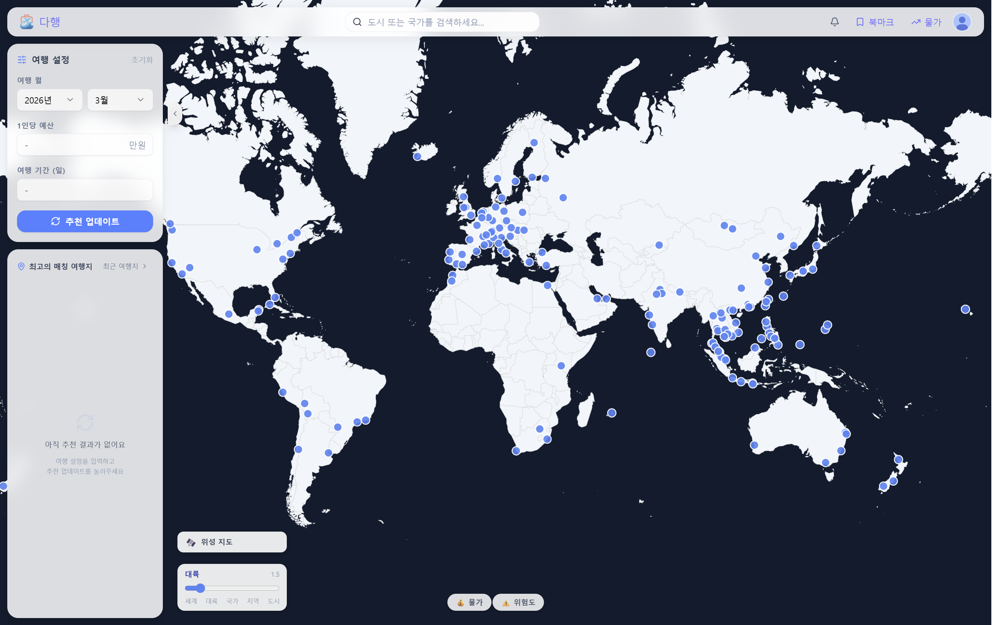
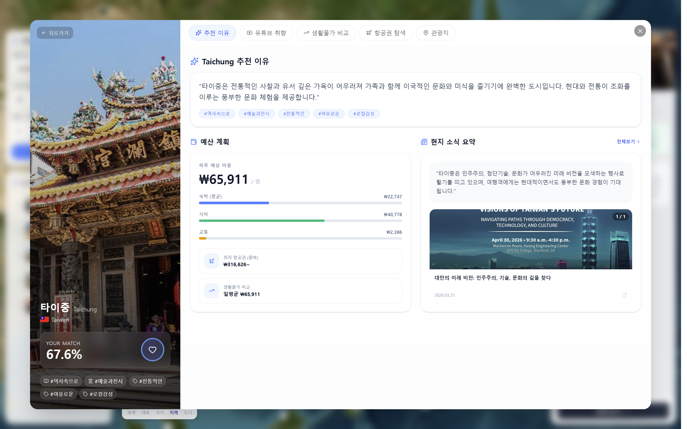
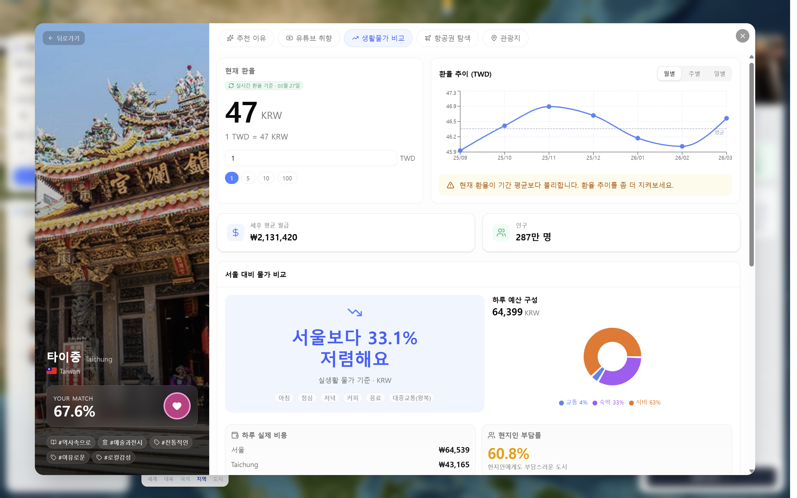
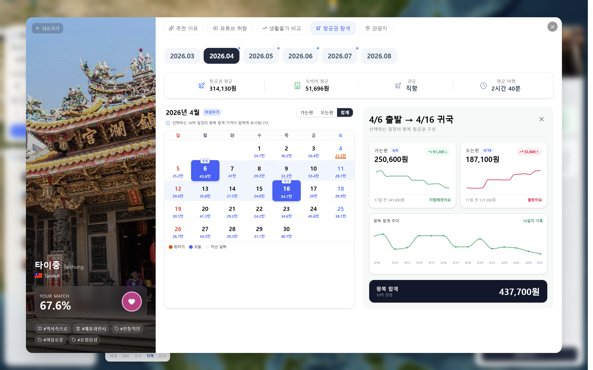
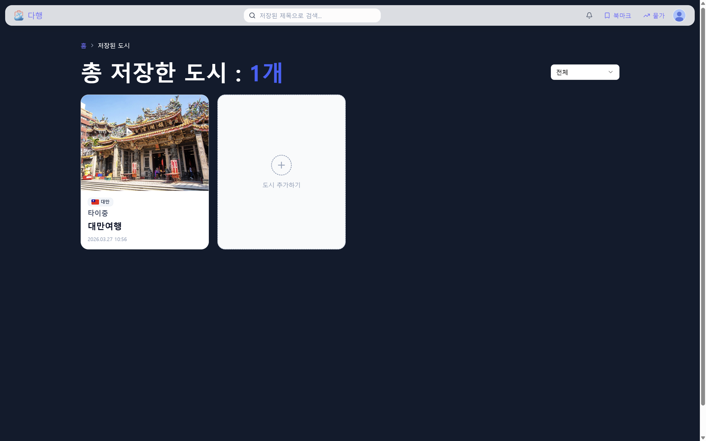

# DAHAENG | AI 여행 추천 & 비용 비교 서비스

<p align="center">
  
</p>

> **YouTube 취향 분석 기반 여행지 추천 서비스 (SSAFY 14기 D206 공통 프로젝트)**
>  
> 사용자 관심사 + 물가/항공 데이터 + 관광지 정보를 결합해 여행 의사결정을 돕는 서비스

---

## 📌 프로젝트 개요

**다행(DAHAENG)**은 Google/YouTube 연동을 통해 사용자의 관심사를 분석하고,  
이를 바탕으로 **추천 도시, 추천 이유, 물가 비교, 항공권 트렌드, 관광지 탐색**을 한 번에 제공하는 여행 추천 서비스입니다.

단순 추천에서 끝나지 않고, **추천 근거 확인 → 도시 상세 탐색 → 북마크 저장 → 도시 간 비교**까지 이어지는 흐름을 지원합니다.

---

## 🎯 왜 만들었나요

여행지를 정할 때 자주 생기는 문제를 해결하고자 했습니다.

* **정보가 흩어져 있어 의사결정이 느림**
  * 관심사, 물가, 항공권, 관광 정보를 각각 찾아야 해서 비교가 어렵습니다.
* **개인 취향 반영 부족**
  * 인기순/광고 중심 추천은 사용자 성향과 맞지 않는 경우가 많습니다.
* **추천 근거의 불투명성**
  * 왜 이 도시가 추천됐는지 설명이 부족하면 신뢰도가 떨어집니다.

➡️ **다행은 취향 데이터 + 정량 데이터(물가/항공/환율)를 결합해, 이유가 보이는 추천을 제공합니다.**

---

## 👥 대상 사용자

* 취향 기반으로 여행지를 빠르게 고르고 싶은 사용자
* 예산을 고려해 도시를 비교하고 싶은 사용자
* 항공권/물가/관광지 정보를 한 화면에서 보고 싶은 사용자

---

## 🚀 기대 효과

* **탐색 시간 단축**: 여러 사이트를 오가지 않고 한 흐름에서 확인
* **개인화 추천 강화**: YouTube 기반 관심사 분석 반영
* **의사결정 신뢰도 향상**: 추천 근거와 비용 데이터를 함께 제공

---

## ✨ 핵심 기능

* Google OAuth 로그인 및 YouTube 연동
* YouTube 기반 사용자 취향 태그 분석
* AI 기반 여행 도시 추천 및 추천 이유 제공
* 도시 상세 정보 제공 (핵심 요약/분석 근거/관광지)
* 생활물가 비교 (요약/항목별/세부 품목)
* 항공권 캘린더 및 트렌드 조회
* 북마크 저장/조회 및 도시 간 비교

---

## 🏗 시스템 아키텍처

### 구성 요소

* **Frontend**: React + Vite 기반 SPA
  * 추천 결과, 상세 페이지, 물가 비교, 북마크 UI 제공
* **Backend**: Spring Boot API 서버
  * 인증, 추천, 물가/항공/관광지/북마크 API 제공
* **Data Pipeline**: Python 수집/정제 모듈
  * 항공권, 생활물가, 환율, 국가 위험도 데이터 수집 및 적재
* **Storage / DB**
  * MySQL, MongoDB, Redis, (배치 환경에서 HDFS 연동 가능)

### 데이터 흐름 (요약)

1. 사용자가 Google 로그인 후 YouTube 연동
2. YouTube 데이터 기반 취향 태그 분석
3. 사용자가 예산/기간 등 조건 입력
4. 추천 엔진이 도시 후보 점수화 및 추천 결과 생성
5. 물가/항공/관광지/환율 데이터를 결합해 상세 정보 제공
6. 사용자가 북마크 저장 및 도시 비교 수행

---

## 🛠 기술 스택

### 🔹 Backend

* **Java 17**
* **Spring Boot 3.5.11**
* Spring Security / OAuth2 Client / JWT
* Spring Data JPA / MongoDB / Redis
* Spring AI (OpenAI Starter)
* Gradle

### 🔹 Frontend

* **TypeScript 5**
* **React 19**
* **Vite 7**
* TanStack Router / TanStack Query / Zustand
* Tailwind CSS v4 + shadcn/ui
* Recharts / react-globe.gl / maplibre-gl

### 🔹 Data / Infra

* **Python 3.11+** (데이터 수집/파이프라인)
* **MySQL / MongoDB / Redis**
* **Docker / Docker Compose**
* **Nginx + HTTPS(운영 배포)**

### 🔹 Collaboration Tools

* Git / GitLab
* Jira / Notion

---

## ⚙️ 개발 환경

### Frontend

* Node.js 20+
* pnpm 9+

### Backend

* Java 17
* Gradle

### Data Pipeline

* Python 3.11+

---

## ▶️ 실행 방법 (로컬 예시)

```bash
# frontend
cd frontend
pnpm install
pnpm dev

# backend
cd backend/dahaeng
./gradlew bootRun
```

### 데이터 파이프라인 (선택 실행 예시)

```bash
# 환율 수집
cd data/exchange
python main.py

# 생활물가 수집
cd data/livingcost
python main.py
```

---

## ▶️ 실행 방법 (서버 예시)

> Docker 기반 배포 환경에서 실행됩니다.  
> 상세 설정/환경 변수/HTTPS 배포는 `exec/PORTING_MANUAL.md`, `deploy/app/README.md` 참고

---

## 📁 폴더 구조 (요약)

```text
.
├── backend/dahaeng/   # Spring Boot 백엔드
├── frontend/          # React 프론트엔드
├── data/              # 데이터 수집/정제 파이프라인
├── deploy/            # Docker/Nginx 배포 설정
├── exec/              # 포팅/시연 문서 및 스크린샷
├── ai/                # AI 관련 보조 문서
└── Jira/              # Jira 연동/운영 스크립트
```

---

## 📚 참고 문서

* `exec/PORTING_MANUAL.md`: 포팅 및 실행 가이드
* `deploy/app/README.md`: EC2 + Docker + Nginx 배포 가이드
* `exec/DEMO_SENARIO.md`: 데모 시나리오
* `backend/dahaeng/docs/`: 백엔드 도메인 상세 문서

---

## 🖼 화면 구성

### 메인 추천 화면
<p align="center">
  
</p>

### 추천 도시 상세
<p align="center">
  
</p>

### 생활물가 비교
<p align="center">
  
</p>

### 항공권 탐색
<p align="center">
  
</p>

### 북마크 / 비교
<p align="center">
  
</p>
